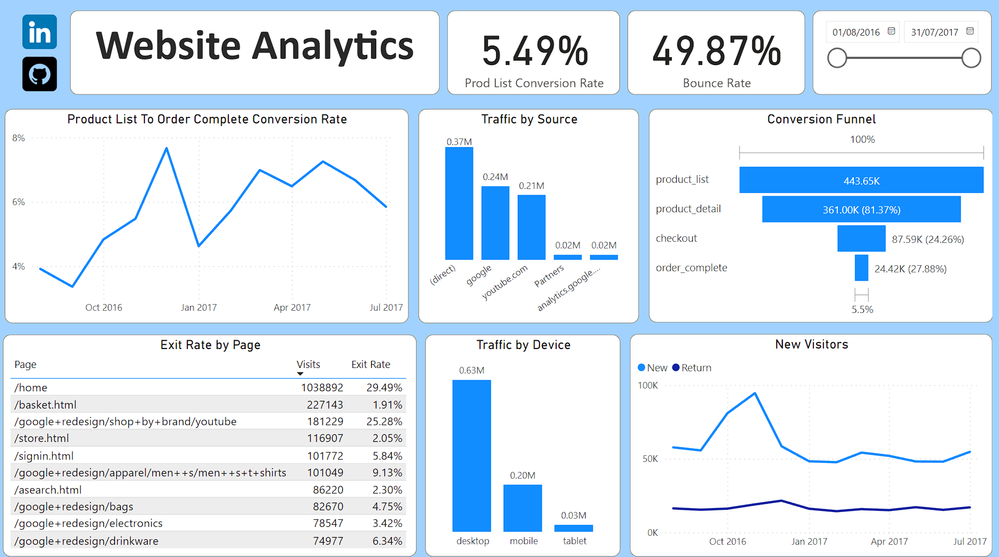
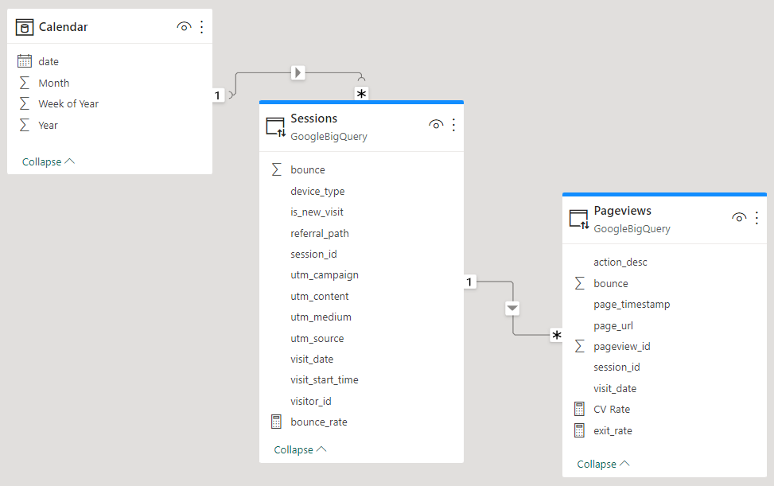

# Dashboard Web Analytics



<p>Esse projeto foi feito a partir dos dados do Google Analytics disponibilizados pelo Google, que foram persistidos no Google BigQuery utilizando SQL e posteriormente organizados visualmente utilizando Power BI.</p>


<a href="https://app.powerbi.com/view?r=eyJrIjoiOGY3NTI1NjYtNGY3ZS00OWYwLWEwNDEtYTQ3OGQ0NDNiODVjIiwidCI6IjFkNWVmZGJiLTQxNjUtNDUzMi05NDE5LWQ5N2FmYzgwZTBkOSJ9">Link do Dashboard</a>

<h2>Problema de negócio</h2>

<p>Avaliar o desempenho de seus websites e identificar oportunidades de melhoria. Para isso, o Dashboard apresenta várias métricas importantes, como Bounce Rate, Exit Rate, Conversion Rate e Conversion Funnel.</p>

<h2>Indicadores Utilizados</h2>

<p>O <b>Bounce Rate</b> é a porcentagem de visitas que saem do seu site após visualizar apenas uma página. Uma alta taxa de rejeição pode indicar que as pessoas não estão encontrando o que procuram em seu site ou que sua página inicial não é atraente o suficiente.</p>

<p>O <b>Exit Rate</b>, por outro lado, é a porcentagem de visitas que saem do seu site após visualizar uma ou mais páginas. Ele pode ser usado para identificar as páginas específicas que estão levando as pessoas a sair do seu site.</p>

<p>O <b>Conversion Rate</b> é a porcentagem de visitantes do seu site que realizam uma ação específica, como comprar um produto ou preencher um formulário de contato. Ele é uma métrica importante para avaliar a eficácia do seu site em atingir seus objetivos de negócios.</p>

<p>Por fim, o <b>Conversion Funnel</b> é uma visualização que mostra as etapas que os visitantes do seu site passam antes de realizar uma conversão. Isso pode ajudar a identificar pontos problemáticos no processo de conversão e melhorá-lo para aumentar a taxa de conversão.</p>

<h2>Modelagem de dados</h2>



<h2>Medidas Utilizadas</h2>

<h3>Bounce Rate</h3>

```
Bounce Rate = 
VAR TotalBounces =
SUM(Sessions[bounce]
VAR TotalSessions =
DISTINCTCOUNT(Sessions[session_id])
VAR Ratio =
DIVIDE(
    TotalBounces,
    TotalSessions,
    "-"
)
RETURN Ratio
```

<h3>Conversion Rate</h3>

```
CV Rate = 
VAR OrderCompleteSessions =
CALCULATE(
    COUNT(Pageviews[pageview_id]), 
    'Pageviews'[action_desc] = "order_complete"
)
VAR ProductListSessions =
CALCULATE(
    COUNT(Pageviews[pageview_id]),
    'Pageviews'[action_desc] = "product_list"
)
VAR Ratio =
DIVIDE(
    OrderCompleteSessions,
    ProductListSessions,
    "-"
)
RETURN Ratio
```

<h3>Exit Rate</h3>

```
Exit Rate = 
VAR TotalBounces = 
SUM(Pageviews[bounce])
VAR TotalPageviews =
DISTINCTCOUNT(Pageviews[pageview_id])
VAR Ratio =
DIVIDE(
    TotalBounces,
    TotalPageviews,
    "-"
)
RETURN Ratio
```
